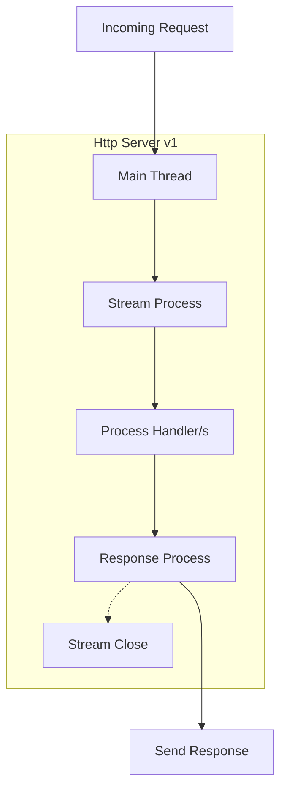
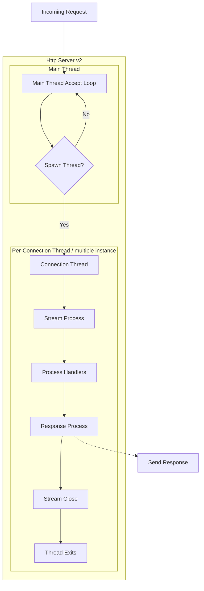
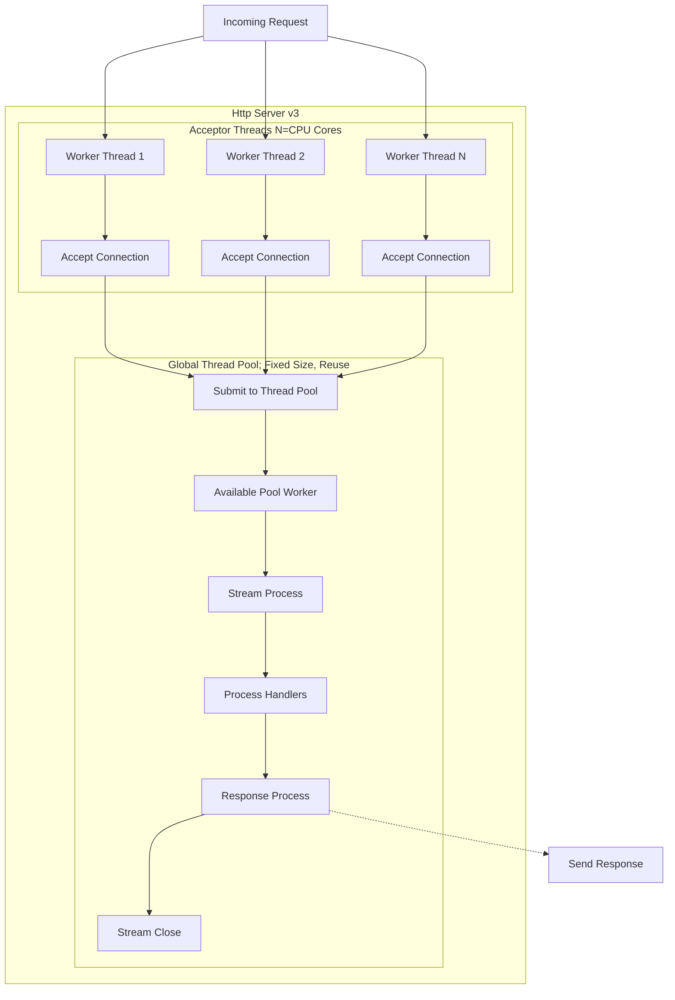

# HTTP Server Design Architect in [Zig](https://ziglang.org)

<details close>
<summary>TL;DR</summary>
HTTP Server Design in Zig (Three Concurrency Models)

• Designed and implemented three minimal HTTP server versions in Zig, each with identical routing logic but distinct concurrency architectures to demonstrate trade-offs between throughput, latency, and complexity.

• Version 1 (Single-Threaded): Built a sequential server using stack-allocated buffers and arena allocators per connection. Achieved 54k req/s with 16.9µs avg latency. Ideal for low-load or educational use.

• Version 2 (Thread-per-Connection): Implemented detached OS thread spawning per accepted connection. Scaled to 254k req/s (4.7x v1) but introduced thread creation overhead and 207µs latency variance.

• Version 3 (Worker Pool + Multiple Acceptors): Engineered a fixed-size thread pool with per-CPU acceptor threads using SO_REUSEPORT. Eliminated per-connection thread churn, achieving 248k req/s with 38.9µs avg latency — 5x lower than v2 at similar throughput.

• Concurrency Analysis: Quantified trade-offs across three models — sequential blocking, thread-per-connection, and pooled acceptors — providing clear guidance: v2 balances workload for most cases, v3 for latency-sensitive services.

• Tech Stack: Zig 0.16.0, std.Thread, std.Io.Threaded pool, SO_REUSEPORT, arena allocators, wrk benchmarking.

• Outcome: Demonstrated that decoupling connection acceptance from request handling with multiple acceptors slashes latency by 5× while maintaining throughput, matching patterns used in production servers (NGINX, Go’s net/http).
</details>

__*IMPORTANT:*__
```sh
# zig version
0.16.0-dev.3059+42e33db9d
```

###### As long the programming language has `Thread API` these design is applicable.

## Brief

Three versions of a minimal HTTP server are provided,
each implementing the same routing logic (`/` > 200 OK, else 404, non‑GET > 405)
__*but with different concurrency models.*__ Below is an architectural breakdown and a comparative summary.

---

## HLD

### [Version 1 – Single‑Threaded, Sequential](./src/http_server_v1.zig)

**Architecture:**
- Main loop: `accept()` > call `handlers()` directly > process entire connection (including keep‑alive) > return to `accept()`.
- No concurrency: a single OS thread handles one client at a time.
- Uses stack‑allocated buffers and an arena allocator per connection.

**Graph:**


**Strengths:**
- Extremely simple, no synchronisation overhead.
- Low memory footprint.

**Trade-off:**
- Blocking I/O and sequential processing limit throughput.
- A slow client can stall all others.

**Benchmark (`wrk -c100 -t2 -d10s http://localhost:9001/`):**
```
Running 10s test @ http://localhost:9001/
  2 threads and 100 connections
  Thread Stats   Avg      Stdev     Max   +/- Stdev
    Latency    16.87us    3.57us   0.98ms   97.85%
    Req/Sec    54.75k     1.78k   56.44k    84.00%
  544993 requests in 10.03s, 44.70MB read
Requests/sec:  54322.08
Transfer/sec:      4.46MB
```
> Suitable for very low‑load or educational purposes.

**Key characteristics:**
- Single accept() loop in main thread
- No concurrency: one client at a time
- Arena allocator per connection (deallocated on return)
- Zero heap allocation in hot path (stack buffers)
- Simplest possible design
- Throughput limited by sequential processing

---

### [Version 2 – Thread‑per‑Connection](./src/http_server_v2.zig)

**Architecture:**
- Main thread `accept()`s connections.
- For each accepted `stream`, spawns a new OS thread (`std.Thread.spawn`) that runs `handlers()`.
- Threads are **detached** – no explicit joining, resources reclaimed on exit.

**Graph:**


**Strengths:**
- Full parallelism: many clients are handled simultaneously.
- Simple to implement (just add threading around the handler).

**Trade-off:**
- Thread creation/destruction overhead for every connection (though keep‑alive amortises this).
- Can exhaust system resources under very high concurrency (thousands of threads).
- Context switching overhead becomes non‑negligible.

**Benchmark (`wrk -c100 -t2 -d10s http://localhost:9002/`):**
```
Running 10s test @ http://localhost:9002/
  2 threads and 100 connections
  Thread Stats   Avg      Stdev     Max   +/- Stdev
    Latency   207.34us  207.70us  17.09ms   99.61%
    Req/Sec   127.71k     4.03k  137.87k    77.00%
  2541208 requests in 10.00s, 208.42MB read
Requests/sec: 254072.04
Transfer/sec:     20.84MB
```
> 4.7× higher throughput than v1, but at the cost of higher latency variance.

**Key characteristics:**
- Single accept() thread
- New OS thread per connection (detached)
- Arena allocator per thread (deallocated on thread exit)
- High thread creation/destruction overhead
- Full parallelism, but context switching cost
- Memory usage grows linearly with active connections

---

### [Version 3 – Worker Pool with Multiple Acceptors](./src/http_server_v3.zig)

**Architecture:**
- Configurable number of worker threads (`WORKERS=0` > number of CPU cores).
- Each worker thread:
  1. Creates its **own** listening socket on the same address/port (requires `SO_REUSEPORT` – see note below).
  2. Accepts connections independently.
  3. For each accepted connection, submits the `handlers` function to a global thread pool (`std.Io.Threaded`).
- The thread pool executes handlers concurrently, reusing a fixed set of threads.

**Graph:**


**Strengths:**
- No per‑connection thread creation overhead.
- Multiple acceptors reduce lock contention on the listen socket.
- Thread pool limits total thread count, preventing resource exhaustion.
- Lower and more stable latency than v2 (better CPU cache behaviour, less scheduling noise).

**Trade-off:**
- Complex: requires careful handling of shared state (here global static variables are used, which is error‑prone).
- Portability issue: multiple sockets binding to the same port requires `SO_REUSEPORT` – the code only sets `reuse_address` (`SO_REUSEADDR`), which may fail on some systems.

**Benchmark (`wrk -c100 -t2 -d10s http://localhost:9003/`):**
```
Running 10s test @ http://localhost:9003/
  2 threads and 100 connections
  Thread Stats   Avg      Stdev     Max   +/- Stdev
    Latency    38.91us   20.88us   4.02ms   84.29%
    Req/Sec   124.77k     5.31k  138.64k    62.00%
  2481905 requests in 10.00s, 203.56MB read
Requests/sec: 248159.80
Transfer/sec:     20.35MB
```
> Throughput similar to v2 but with **5× lower average latency** and much better stability.

**Key characteristics:**
- Multiple accept() threads (one per CPU core) – reduces lock contention
- Each acceptor has its own listening socket (requires SO_REUSEPORT)
- Global thread pool (fixed size) – no per‑connection thread creation
- Handler tasks submitted to pool, executed asynchronously
- Arena allocator per handler invocation (deallocated on return)
- Lowest latency, highest throughput, complex

---

## Architectural Evolution Summary

| Version | Concurrency Model                | Throughput (req/s) | Avg Latency | Memory per Connection       | Thread Overhead          | Complexity | Best & Suits For                     |
|:-       |:-                                |:-                  |:-           |:-                           |:-                        |:-          |:-                                    |
| **v1**  | Single‑threaded, sequential      | 54k                | 16.9 µs     | Arena (4 KB) + stack        | None                     | Very low   | Low‑load, learning, embedded         |
| **v2**  | Thread‑per‑connection            | 254k               | 207 µs      | Arena (4 KB) + thread stack | OS thread create/destroy | Low        | General purpose, balanced throughput |
| **v3**  | Worker pool + multiple acceptors | 248k               | 38.9 µs     | Arena (4 KB) + pool reuse   | Fixed thread pool        | High       | Low‑latency, high‑concurrency        |

**Key insight:**
Moving from v1 to v2 exploits multi‑core CPUs but introduces thread management costs.
v3 refines this by decoupling connection acceptance from request handling,
using a fixed‑size thread pool and multiple acceptors to reduce contention and eliminate per‑connection thread creation.
The result is similar throughput but far superior latency and resource efficiency.

**Note on v3 implementation:**
The use of static variables and per‑worker listening sockets is unconventional.
A more robust design would share a single listening socket across all worker threads (using `accept` with proper synchronisation or `SO_REUSEPORT`).
Nevertheless, the architectural idea of a worker pool is sound and matches patterns used in production servers (e.g., NGINX, Go’s net/http).

**Key takeaway:**
- **v1** is trivial but not scalable.
- **v2** gives the best raw throughput per line of code, at the cost of higher and more variable latency.
- **v3** matches v2’s throughput while **slashing latency by 5×** and eliminating per‑connection thread churn, making it the choice for latency‑sensitive services.

*"For balance workload, v2 is suits for most case,
if low latency is required, consider use v3"*  @prothegee

<br>

---

###### end of readme
