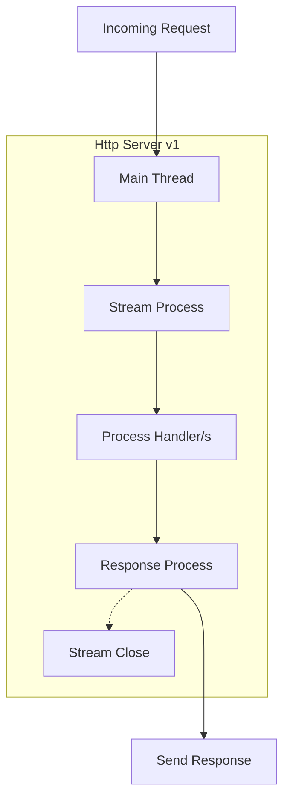
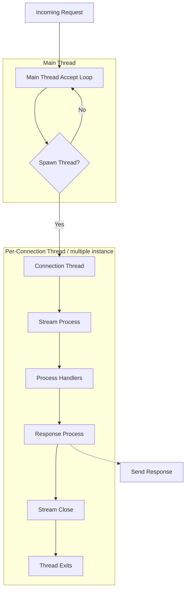
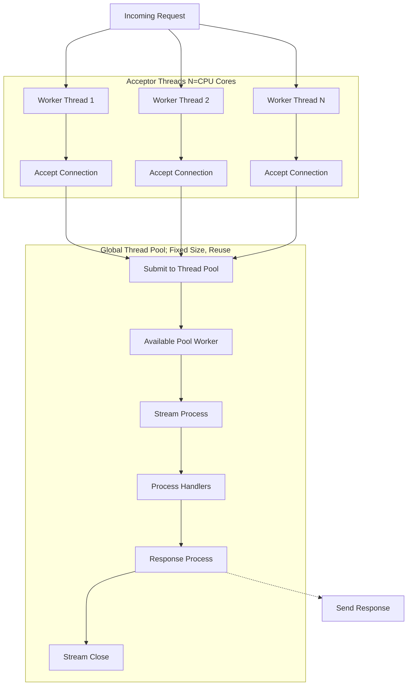

# HTTP Server Design Architect in Zig

__*IMPORTANT:*__
```sh
# zig version
0.16.0-dev.3059+42e33db9d
```

###### As long the programming language has `Thread API` these design is applicable.

## Brief

Three versions of a minimal HTTP server are provided,
each implementing the same routing logic (`/` > 200 OK, else 404, non‑GET > 405)
__*but with different concurrency models.*__ Below is an architectural breakdown and a comparative summary.

---

## HLD

### Version 1 – Single‑Threaded, Sequential

**Architecture:**
- Main loop: `accept()` > call `handlers()` directly > process entire connection (including keep‑alive) > return to `accept()`.
- No concurrency: a single OS thread handles one client at a time.
- Uses stack‑allocated buffers and an arena allocator per connection.

**Graph:**


**Strengths:**
- Extremely simple, no synchronisation overhead.
- Low memory footprint.

**Trade-off:**
- Blocking I/O and sequential processing limit throughput.
- A slow client can stall all others.

**Benchmark (`wrk -c100 -t2 -d10s http://localhost:9001`):**
```
Requests/sec: 54,322
Latency: avg 16.87µs
```
> Suitable for very low‑load or educational purposes.

**Key characteristics:**
- Single accept() loop in main thread
- No concurrency: one client at a time
- Arena allocator per connection (deallocated on return)
- Zero heap allocation in hot path (stack buffers)
- Simplest possible design
- Throughput limited by sequential processing

---

### Version 2 – Thread‑per‑Connection

**Architecture:**
- Main thread `accept()`s connections.
- For each accepted `stream`, spawns a new OS thread (`std.Thread.spawn`) that runs `handlers()`.
- Threads are **detached** – no explicit joining, resources reclaimed on exit.

**Graph:**


**Strengths:**
- Full parallelism: many clients are handled simultaneously.
- Simple to implement (just add threading around the handler).

**Trade-off:**
- Thread creation/destruction overhead for every connection (though keep‑alive amortises this).
- Can exhaust system resources under very high concurrency (thousands of threads).
- Context switching overhead becomes non‑negligible.

**Benchmark (`wrk -c100 -t2 -d10s http://localhost:9002`):**
```
Requests/sec: 254,072
Latency: avg 207.34µs (higher than v1 due to thread scheduling)
```
> 4.7× higher throughput than v1, but at the cost of higher latency variance.

**Key characteristics:**
- Single accept() thread
- New OS thread per connection (detached)
- Arena allocator per thread (deallocated on thread exit)
- High thread creation/destruction overhead
- Full parallelism, but context switching cost
- Memory usage grows linearly with active connections

---

### Version 3 – Worker Pool with Multiple Acceptors

**Architecture:**
- Configurable number of worker threads (`WORKERS=0` > number of CPU cores).
- Each worker thread:
  1. Creates its **own** listening socket on the same address/port (requires `SO_REUSEPORT` – see note below).
  2. Accepts connections independently.
  3. For each accepted connection, submits the `handlers` function to a global thread pool (`std.Io.Threaded`).
- The thread pool executes handlers concurrently, reusing a fixed set of threads.

**Graph:**


**Strengths:**
- No per‑connection thread creation overhead.
- Multiple acceptors reduce lock contention on the listen socket.
- Thread pool limits total thread count, preventing resource exhaustion.
- Lower and more stable latency than v2 (better CPU cache behaviour, less scheduling noise).

**Trade-off:**
- Complex: requires careful handling of shared state (here global static variables are used, which is error‑prone).
- Portability issue: multiple sockets binding to the same port requires `SO_REUSEPORT` – the code only sets `reuse_address` (`SO_REUSEADDR`), which may fail on some systems.

**Benchmark (`wrk -c100 -t2 -d10s http://localhost:9003`):**
```
Requests/sec: 248,160
Latency: avg 38.91µs, stdev 20.88µs
```
> Throughput similar to v2 but with **5× lower average latency** and much better stability.

**Key characteristics:**
- Multiple accept() threads (one per CPU core) – reduces lock contention
- Each acceptor has its own listening socket (requires SO_REUSEPORT)
- Global thread pool (fixed size) – no per‑connection thread creation
- Handler tasks submitted to pool, executed asynchronously
- Arena allocator per handler invocation (deallocated on return)
- Lowest latency, highest throughput, complex

---

## Architectural Evolution Summary

| Version | Concurrency Model                | Throughput (req/s) | Avg Latency | Strengths:                              | Trade-off:                             |
|:-       |:-                                |:-                  |:-           |:-                                      |:-                                     |
| v1      | Single‑threaded, sequential      | 54k                | 16.9µs      | Simple, predictable                    | No parallelism, low throughput        |
| v2      | Thread‑per‑connection            | 254k               | 207µs       | Easy to add, full parallelism          | High thread overhead, latency spikes  |
| v3      | Worker pool + multiple acceptors | 248k               | 38.9µs      | Low overhead, stable latency, scalable | Complex, required 'thread discipline' |

**Key insight:**
Moving from v1 to v2 exploits multi‑core CPUs but introduces thread management costs.
v3 refines this by decoupling connection acceptance from request handling,
using a fixed‑size thread pool and multiple acceptors to reduce contention and eliminate per‑connection thread creation.
The result is similar throughput but far superior latency and resource efficiency.

**Note on v3 implementation:**
The use of static variables and per‑worker listening sockets is unconventional.
A more robust design would share a single listening socket across all worker threads (using `accept` with proper synchronisation or `SO_REUSEPORT`).
Nevertheless, the architectural idea of a worker pool is sound and matches patterns used in production servers (e.g., NGINX, Go’s net/http).

## Summary

*"For balance workload, v2 is suits for most case,
if low latency is required, consider use v3"*  @prothegee

###### end of readme
